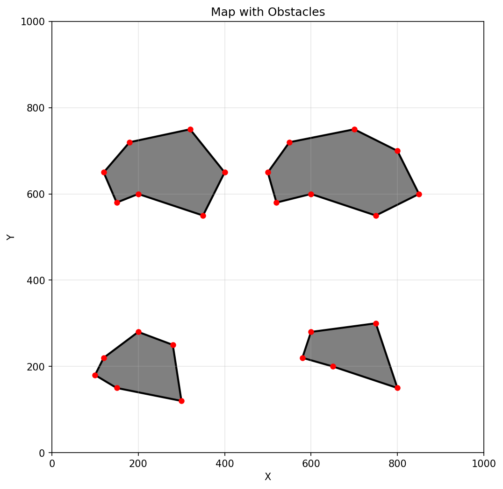
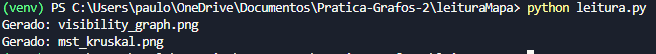
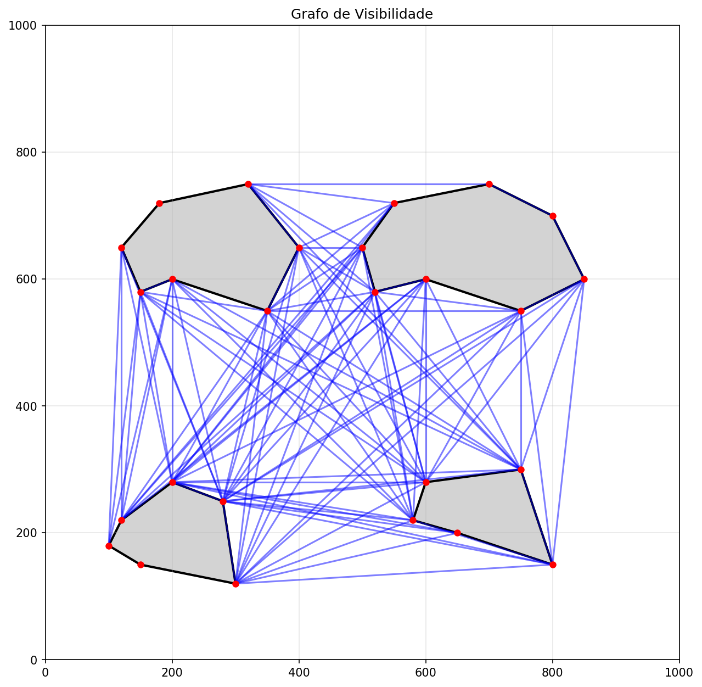
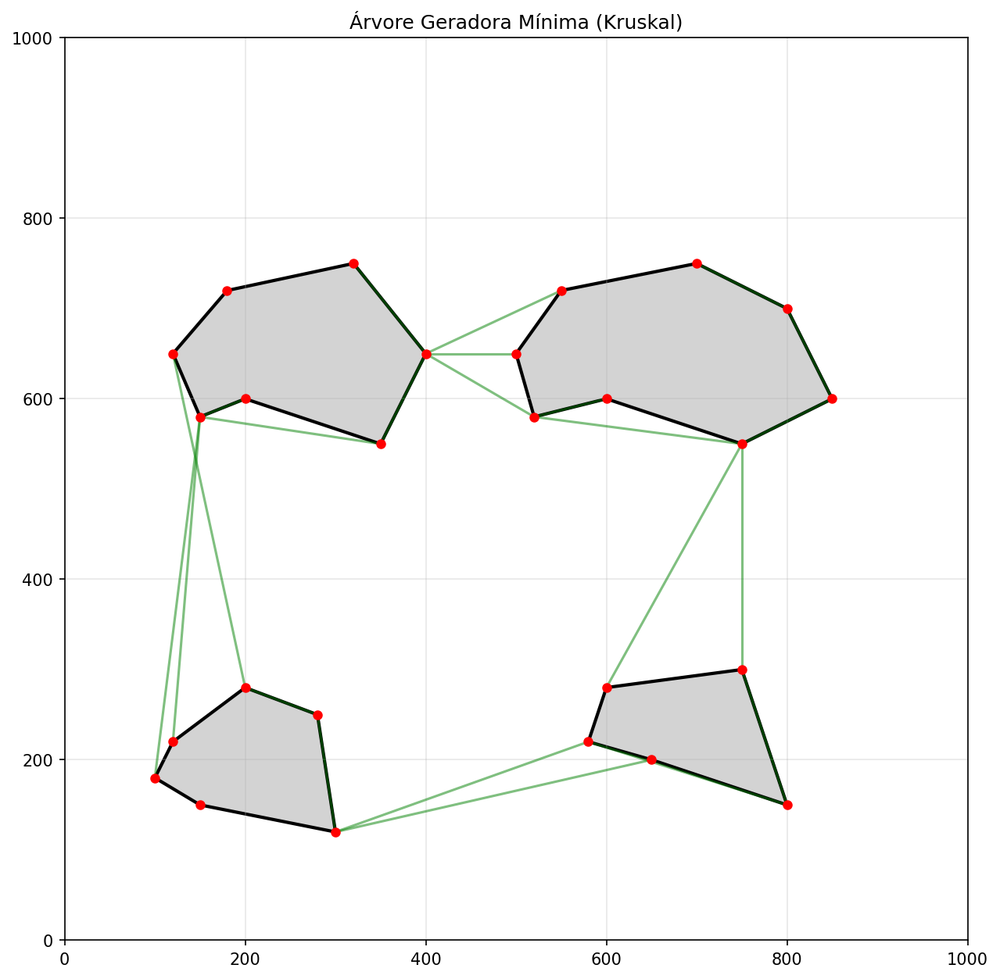
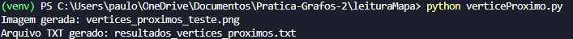
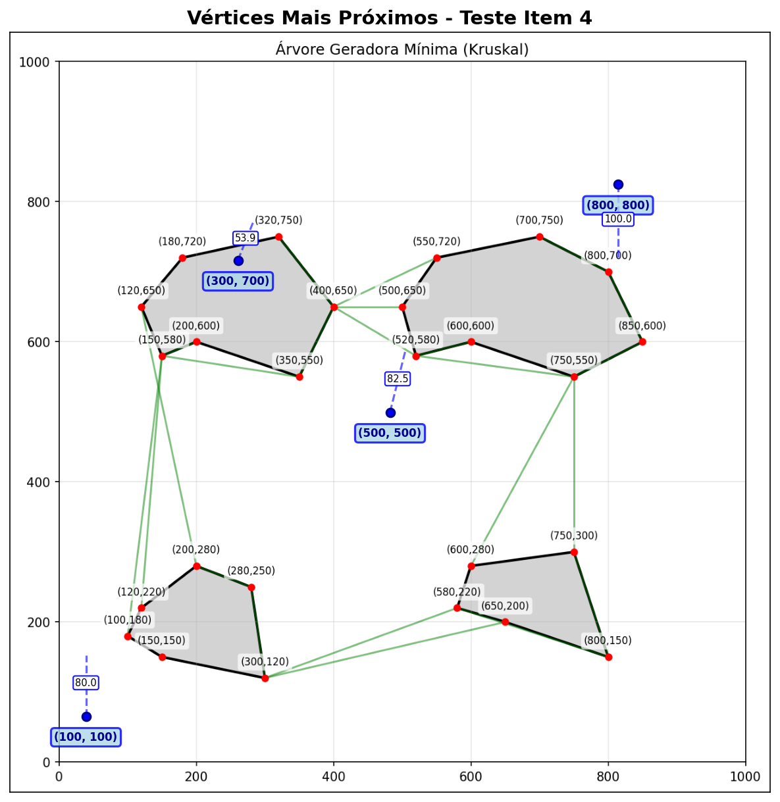

# Prática 2 - Grafos para navegação
# Autores: Abraão Melo, Mayara Jacinto e Paulo Veras

## Passos para Instalação

Clone o repositório:
```bash
git clone https://github.com/paulosergioveras/Pratica-Grafos-2.git
cd Pratica-Grafos-2
```

Crie um ambiente virtual:
```bash
python -m venv venv 
# para linux/mac: python3 -m venv venv
```

Ative o ambiente virtual:
```bash
.\venv\Scripts\activate
# para linux/mac: source venv/bin/activate
```

Instale os requirements:
```bash
pip install -r requirements.txt
```

## Item 1

Inicialmente foi feito alguns arquivos .txt para obter um mapa com quatro obstáculos, após alguns testes feitos no Inkscape, chegamos a um mapa final. Com isso, deixamos apenas um arquivo .txt com as coordenadas dos obstáculos e o um print do Inkscape de como ficou o mapa.
Print do mapa desenhado no Inkscape:



A escala utilizada para o gráfico foi 1000x1000

Caso quiera vizualizar detalhadamente o arquivo .txt e a foto do mapa, use o seguinte comando:

```bash
cd mapa
```

Dentro dessa pasta haverá os arquivos:
1. map.txt -> arquivo .txt com as coordenadas dos obstáculos
2. map.png -> print do desenho do mapa feito no Inkscape
3. mst_tree.txt -> esse arquivo será gerado após rodar o arquivo leitura.py dentro da pasta leituraMapa (passo do item 2)

    
## Item 2 e Item 3

Para a leitura do mapa e a geração do grafo de visibilidade, bem como a árvore usando o algoritmo de Kruskal, siga os seguintes passos:

Entre na pasta leituraMapa:
```bash
cd leituraMapa
```

Compile o arquivo leitura.py:
```bash
python leitura.py
```

Aparecerá isso no terminal:



Após isso, gerará dois arquivos .png nessa pasta:
1. visibility_graph.png
   
   

2. mst_kruskal.png

   


Também irá gerar o arquivo mst_tree.txt na pasta mapa.


## Item 4

Ainda na pasta leituraMapa:

Compile o arquivo verticeProximo.py:
```bash
python verticeProximo.py
```

Aparecerá isso no terminal:



Após isso, gerará dois arquivo nessa pasta:

1. vertices_proximos_teste.png

   


2. resultados_vertices_proximos.txt

   

    

  


